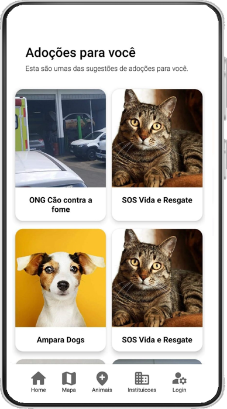
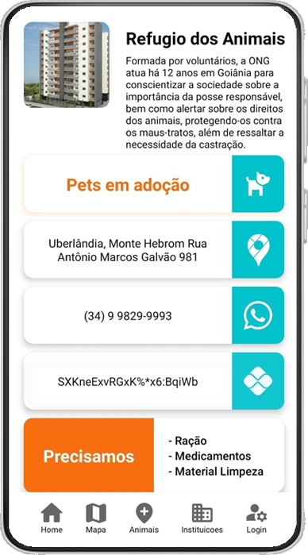
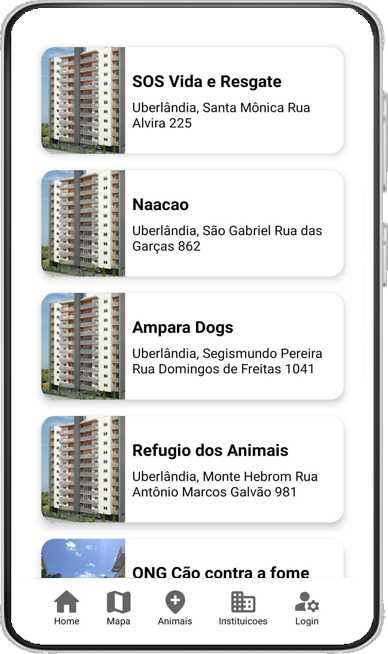
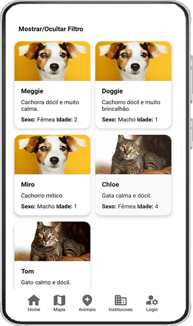

# 🐶 central-animal 🐱
## 📃 Resumo geral
Aplicativo Central Animal que tem objetivo facilitar o resgate, adoção de animais de rua e aumentar a visibilidade de instituições que ajudam animais.

## 💻 Tecnologias utilizadas
</img>
</img>
</img>
</img>
</img>
</img>
</img>

## 📌 Links importantes

## 📱 Imagens do aplicativo
<table>
        <tr>
            <td align="center"> 
                <h2>Home</h2></td>
                <td align="center"> 
                <h2>Detalhamento de instituição</h2></td>
            </td>
        </tr>
        <tr>
            <td align="center"> 
                <h2>Listagem de instituições</h2></td>
                <td align="center"> 
                <h2>Listagem de animais</h2></td>
            </td>
        </tr>
</table>

## ✒️ Autores
<table>
  <tr>
    <td align="center"><a href="https://github.com/ElianMelo"> <b>Elian Melo</b></a> <a href="https://github.com/ElianMelo/central-animal/commits?author=ElianMelo" title="Code">💻</a></td>
    <td align="center"><a href="https://github.com/Henrique-Moreira"> <b>Henrique Moreira</b></a> <a href="https://github.com/ElianMelo/central-animal/commits?author=Henrique-Moreira" title="Code">💻</a></td>
    <td align="center"><a href="https://github.com/LAsant0s"> <b>Luan de Assis</b></a> <a href="https://github.com/ElianMelo/central-animal/commits?author=LAsant0s" title="Code">💻</a></td>
  </tr>
</table>

## 🔒 Licença

[MIT](https://github.com/ElianMelo/central-animal/blob/main/LICENSE.md)
